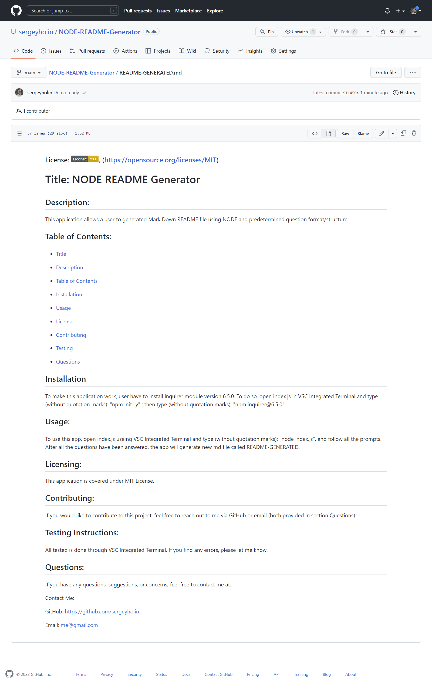

# NODE README Generator
Module 9 Challenge by Sergey Holin

GitHub Repo Link: https://github.com/sergeyholin/NODE-README-Generator

GitHub Live Deployment Link: https://sergeyholin.github.io/NODE-README-Generator/

Video Demo Link: https://drive.google.com/file/d/1pxQEscFJ-o-u4O-mvYCQeQiPDf-eNuTj/view

## ABOUT THE APP:

This application allows a user to generate Mark Down README file using NODE and predetermined question format/structure.

## ACCEPTANCE CRITERIA:

```md
GIVEN a command-line application that accepts user input
WHEN I am prompted for information about my application repository
THEN a high-quality, professional README.md is generated with the title of my project and sections entitled Description, Table of Contents, Installation, Usage, License, Contributing, Tests, and Questions
WHEN I enter my project title
THEN this is displayed as the title of the README
WHEN I enter a description, installation instructions, usage information, contribution guidelines, and test instructions
THEN this information is added to the sections of the README entitled Description, Installation, Usage, Contributing, and Tests
WHEN I choose a license for my application from a list of options
THEN a badge for that license is added near the top of the README and a notice is added to the section of the README entitled License that explains which license the application is covered under
WHEN I enter my GitHub username
THEN this is added to the section of the README entitled Questions, with a link to my GitHub profile
WHEN I enter my email address
THEN this is added to the section of the README entitled Questions, with instructions on how to reach me with additional questions
WHEN I click on the links in the Table of Contents
THEN I am taken to the corresponding section of the README
```
## ADDITIONAL CRITERIA:

Application deployed at live URL.

## SOURCES/CITATIONS: 

Used GitHub docs for badges and license links: https://gist.github.com/lukas-h/2a5d00690736b4c3a7ba

## TECHNOLOGIES USED: 

NODE.js (modules: fs, inquirer 6.5.0)

## SCREENSHOT:




